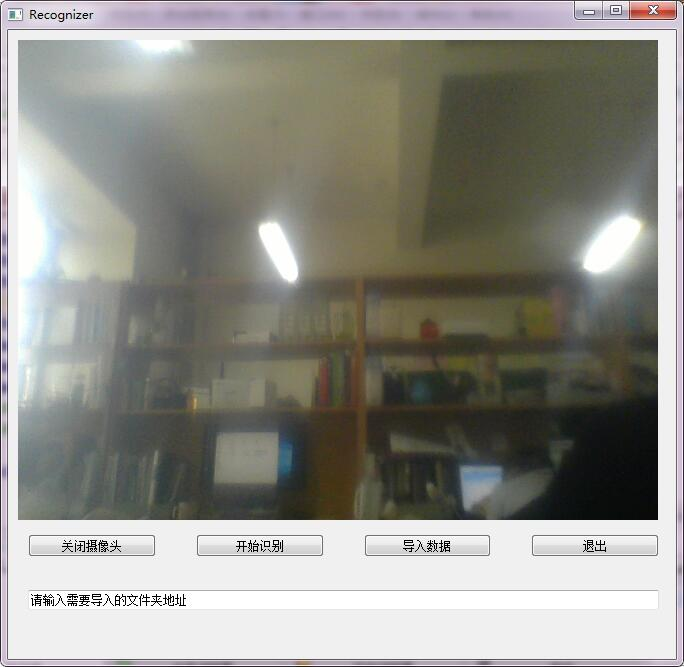

# Insightface-tensorflow

* version 0.4 updating; 

>There may be some bugs in the code,please contact me if you find some of them,thank you~

Redo [ArcFace Additive Angular Margin Loss for Deep Face Recognition](https://arxiv.org/abs/1801.07698)，some of re-releazing codes are referenced and list below,appreciate so much to your opensource.

* https://github.com/deepinsight/insightface (Original)
* https://github.com/luckycallor/InsightFace-tensorflow (Much Appreciate)
* https://github.com/auroua/InsightFace_TF
* https://github.com/tensorflow/models

## Enviroment

version 0.4:

* ubuntu16.04 + 2*GTX 1080ti + Python3.6 + Anaconda5.2.0 + Tensorflow1.7-gpu + MySQL5.7.25 + PyQt5

## Results

|model|lfw|calfw|cplfw|agedb_30|cfp_ff|cfp_fp|lfw_face|
|:----:|:----:|:----:|:----:|:----:|:----:|:----:|:----:|
|resnet_v2_m_50(prelu)|0.979|0.878|0.823|0.886|0.976|0.904|0.866|
|resnet_v2_m_50(leaky_relu)|0.992|0.932|0.860|0.935|0.990|0.910|0.943|

>lfw_face is the lfw dataset that generate by my owm MTCNN model

## Summarize

* Face recognization accuracy is greatly disturbed by face detection;
* One of the most important and confuse things is to select the proper threshold to recognize;

## Face Recognization System

### Face recognizer

Face recognizer is in */recognizer/arcface_recognizer.py*，Face detection is based on my [MTCNN](https://github.com/friedhelm739/MTCNN-tensorflow) repository；

overview of face-recognizer's interface：

>Basic interface：

* get_embd ： interface to get face embeddings，shape=[n,512];
* align_face ： interface of face align;
* recognize ： interface of face recognization, output recognization result and bounding-box(es) of face(s);

>Extended interface：

* add_customs ： add fresh person data to database;
* add_embds ： update embedding data of target member(s) from database(old data will update by average increment);
* update_customs ： update embedding data of target member(s) from database(old data will be replaced);
* del_customs : delete data of target member(s) from database;

### GUI

It's a basic GUI ,a more functional interface will be updated in future version.

